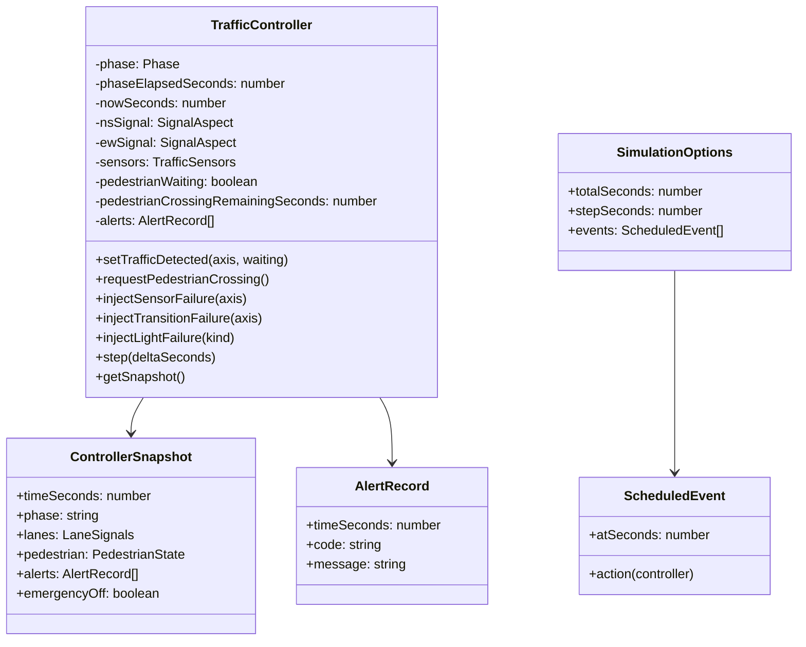
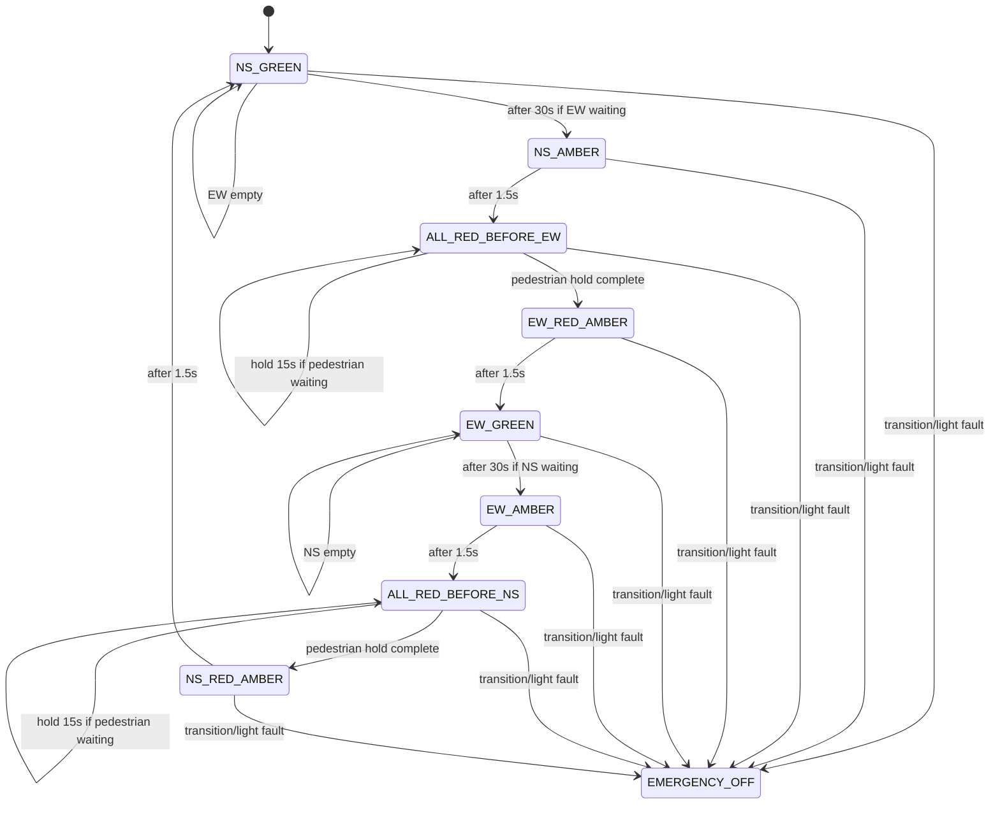

# UML Model (Mermaid)

## Class Diagram

```mermaid
classDiagram
  class TrafficController {
    -phase: Phase
    -phaseElapsedSeconds: number
    -nowSeconds: number
    -nsSignal: SignalAspect
    -ewSignal: SignalAspect
    -sensors: TrafficSensors
    -pedestrianWaiting: boolean
    -pedestrianCrossingRemainingSeconds: number
    -alerts: AlertRecord[]
    +setTrafficDetected(axis, waiting)
    +requestPedestrianCrossing()
    +injectSensorFailure(axis)
    +injectTransitionFailure(axis)
    +injectLightFailure(kind)
    +step(deltaSeconds)
    +getSnapshot()
  }

  class SimulationOptions {
    +totalSeconds: number
    +stepSeconds: number
    +events: ScheduledEvent[]
  }

  class ScheduledEvent {
    +atSeconds: number
    +action(controller)
  }

  class ControllerSnapshot {
    +timeSeconds: number
    +phase: string
    +lanes: LaneSignals
    +pedestrian: PedestrianState
    +alerts: AlertRecord[]
    +emergencyOff: boolean
  }

  class AlertRecord {
    +timeSeconds: number
    +code: string
    +message: string
  }

  TrafficController --> ControllerSnapshot
  TrafficController --> AlertRecord
  SimulationOptions --> ScheduledEvent
```

## State Diagram

```mermaid
stateDiagram-v2
  [*] --> NS_GREEN
  NS_GREEN --> NS_AMBER: after 30s if EW waiting
  NS_GREEN --> NS_GREEN: EW empty
  NS_AMBER --> ALL_RED_BEFORE_EW: after 1.5s
  ALL_RED_BEFORE_EW --> ALL_RED_BEFORE_EW: hold 15s if pedestrian waiting
  ALL_RED_BEFORE_EW --> EW_RED_AMBER: pedestrian hold complete
  EW_RED_AMBER --> EW_GREEN: after 1.5s
  EW_GREEN --> EW_AMBER: after 30s if NS waiting
  EW_GREEN --> EW_GREEN: NS empty
  EW_AMBER --> ALL_RED_BEFORE_NS: after 1.5s
  ALL_RED_BEFORE_NS --> ALL_RED_BEFORE_NS: hold 15s if pedestrian waiting
  ALL_RED_BEFORE_NS --> NS_RED_AMBER: pedestrian hold complete
  NS_RED_AMBER --> NS_GREEN: after 1.5s

  NS_GREEN --> EMERGENCY_OFF: transition/light fault
  NS_AMBER --> EMERGENCY_OFF: transition/light fault
  ALL_RED_BEFORE_EW --> EMERGENCY_OFF: transition/light fault
  EW_RED_AMBER --> EMERGENCY_OFF: transition/light fault
  EW_GREEN --> EMERGENCY_OFF: transition/light fault
  EW_AMBER --> EMERGENCY_OFF: transition/light fault
  ALL_RED_BEFORE_NS --> EMERGENCY_OFF: transition/light fault
  NS_RED_AMBER --> EMERGENCY_OFF: transition/light fault
```
